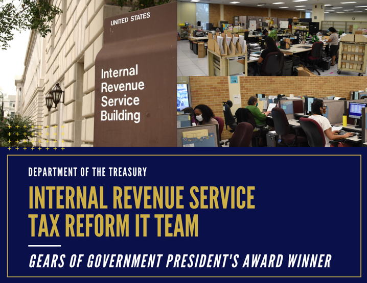
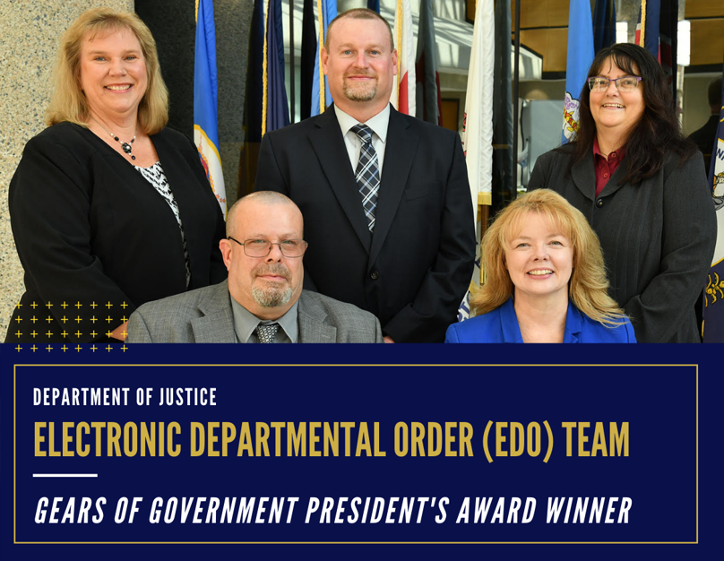
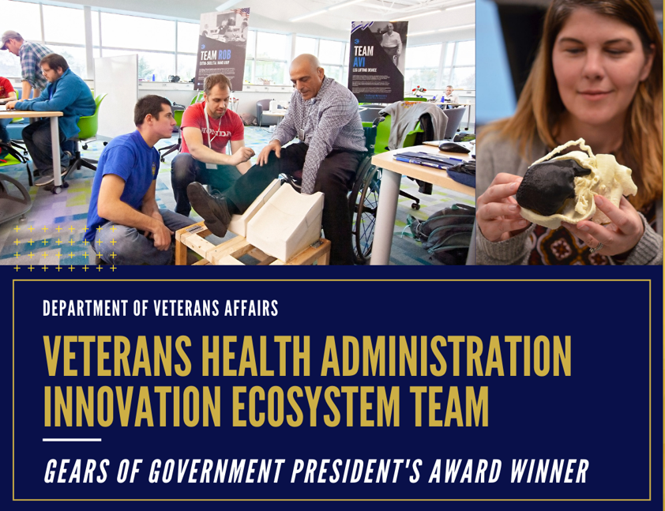
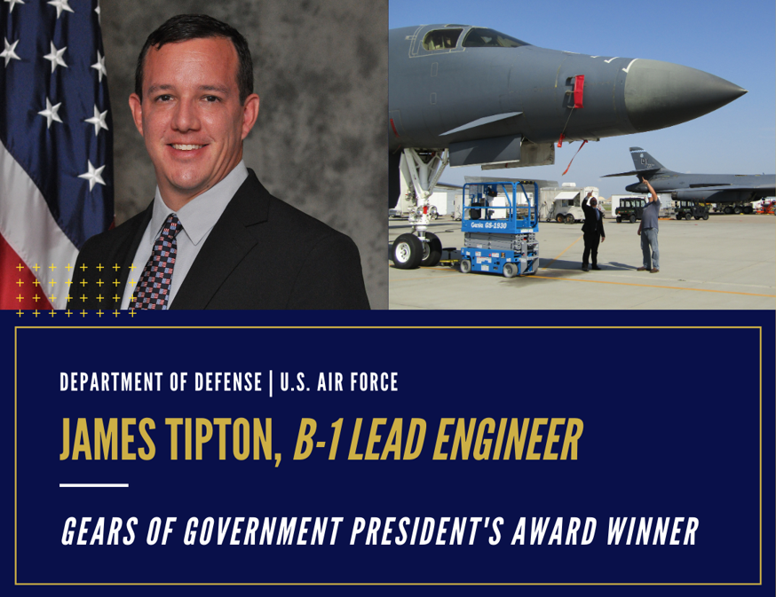
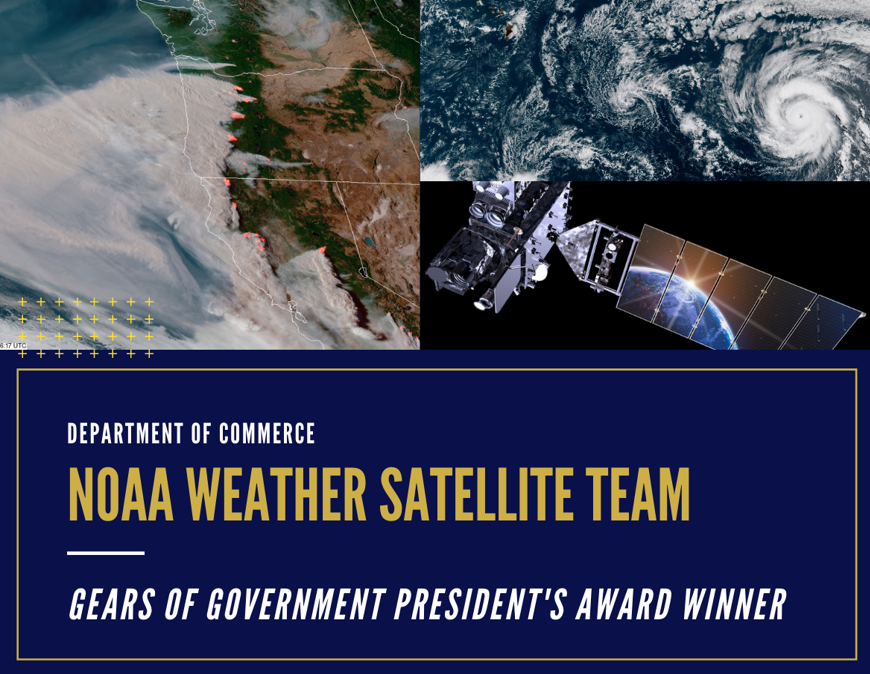
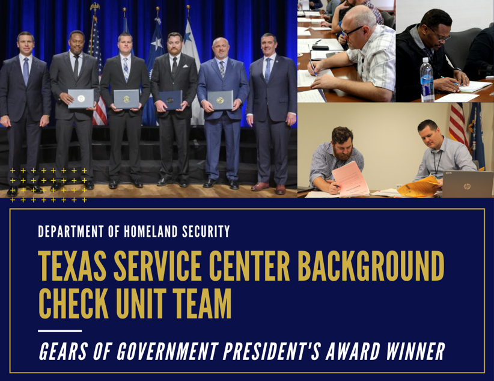

**PRESS RELEASE**

**September 30, 2020**

**Administration Recognizes Federal Employees' Contributions with Gears of Government President’s Awards**

----------------------------------------------------------------------------------------

**Washington** - Today, the Administration announces the winners of the Gears of Government President’s Award. This program recognizes the contributions of individuals and teams across the federal workforce who make a profound difference in the lives of the American people.

**Winners**

**[Internal Revenue Service Tax Reform IT Team](https://www.performance.gov/gearawards/irs-tax-reform/)**

Translated broad tax policy goals from Congress into tangible computer programming changes for IRS technology systems. The team updated more than 140 IT systems and 500 tax products, resulting in effective, timely implementation of tax legislation.

*Members: Nancy Sieger, Kenneth Corbin, Robert Bedoya, Craig Drake, Tracy DeLeon*

**[Electronic Departmental Order (eDO) Team](https://www.performance.gov/gearawards/doj-edo/)**

Implemented a firearm appeal process allowing the public to submit requests and receive responses electronically. Their efforts reduced response times by over 95%, decreased staffing needs by over 70%, and improved customer experience. Translated broad tax policy goals from Congress into tangible computer programming changes for IRS technology systems. The team updated more than 140 IT systems and 500 tax products, resulting in effective, timely implementation of tax legislation.

*Members: Paula J. Zirkle, Charles F. Smith, Joshua A. Cutler, D.R. McCartney, Julie L. Greynolds*

**[Veterans Health Administration Innovation Ecosystem Team](https://www.performance.gov/gearawards/vha-innovation/)**

Developed three major innovations including practices to de-prescribe unnecessary medicine to veterans, prevent pneumonia, and encourage VA Police to carry intranasal opioid overdose reversal medication. Their projects improved care for over 120,000 veterans, lowered costs for taxpayers by over $24 million, saved lives from opioid overdoses, and advanced care for the entire field of medicine.

*Members: Blake Henderson, Allison Amrhein, Brynn Cole, Joshua Patterson, Thomas Osborne*

**[James Tipton](https://www.performance.gov/gearawards/james-tipton/)**

Leveraged advanced software processes to establish a modular software concept and maximize ground-based and operational testing. This software has already saved $1 million and will save $10 million annually, in addition to enhancing operational efficiency.

**[NOAA Weather Satellite Team](https://www.performance.gov/gearawards/noaa-weather-satellite-team/)**

Restored the functionality of NOAA’s new weather satellite following a visibility defect. The team’s innovative techniques and coordinated approach restored the satellite’s ability to observe critical weather conditions across the Western Hemisphere, such as hurricanes, fires, and volcanic activity, with minimal data loss. This team’s response to the crisis restored the value of the nation’s $1 billion investment.

*Members: Harry A. Cikanek III, Vanessa L. Griffin, Director, Daniel T. Lindsey, Joseph A. Pica,
Pamela C. Sullivan*

**[Texas Service Center Background Check Unit Team](https://www.performance.gov/gearawards/texas-background-check-unit/)**

Streamlined the identification of criminal cases for USCIS’ Background Check Unit through collaboration with partners at the DOJ. The team’s work led to a more efficient and effective vetting process, generating a daily average of 600 positive criminal cases, freeing up time to be spent on the most critical cases.

*Members: James K. Bowen, Lawrence W. Barry, Jeffery D. Terry, Charles A. Bullard*

*The Performance.gov team recognizes and congratulates the 2020 Gears of Government President’s Awards winners. To learn more, visit www.performance.gov/gearawards.*
