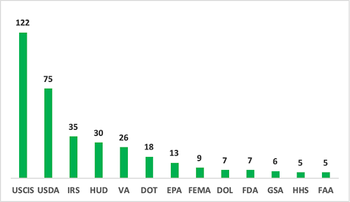
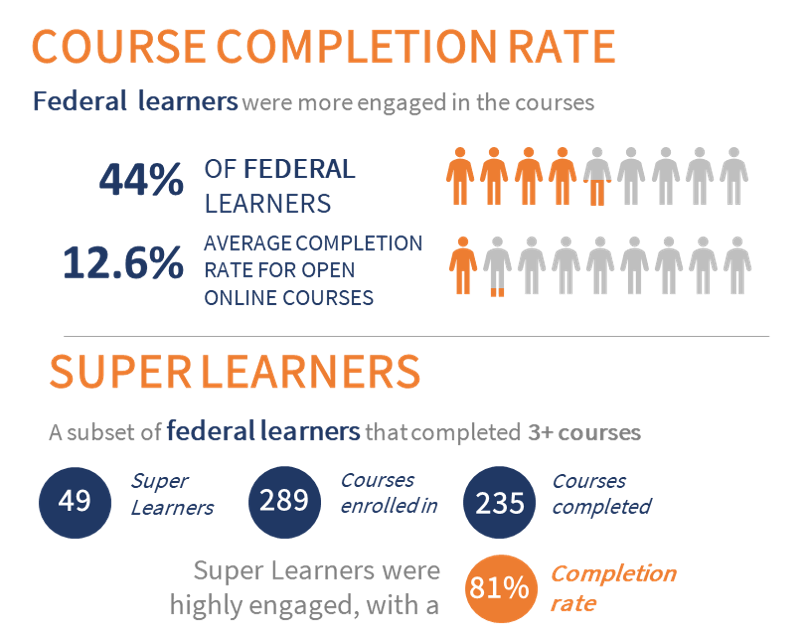

*We’ve invited the GEAR Center Challenge Winners to write “guest blogs” to provide more detail on their projects. The opinions expressed in this guest post are the authors’ own and do not reflect the views of Performance.gov or U.S. General Services Administration.*

There is significant demand for continuing education and training for active public service practitioners. Many full-time working professionals seek to sharpen and build critical skills around the use of data to solve problems and achieve mission goals. These practitioners recognize that the more government can collect, analyze, and lead with quality data, the better the results for citizens and residents.

As winners of one of three [Government Effectiveness Advanced Research (GEAR) Center](https://www.performance.gov/GEARcenter/index.html) Challenge grand prizes in 2019, the Volcker Alliance, the Centers for Civic Impact at Johns Hopkins University (Civic Impact), and the Mid-America Regional Council (MARC) set out to train federal practitioners in the Kansas City region in data management, performance management, and communicating with data. The effort was extremely well received by federal learners and surfaced insights about how to approach training at scale.

**What We Did**

After working with agency leaders to articulate learning goals, Civic Impact developed eighteen unique courses, including instructor-facilitated and self-guided courses. In response to the pandemic, Civic Impact quickly adapted the in-person training to an online format and offered additional online data courses. Despite the disruption of COVID-19, federal learners showed an especially high level of interest in this training opportunity. 

From January 2020 through October 2020, 159 federal practitioners from 24 agencies completed at least one course offered by the GEAR Center Challenge training program. Many completed multiple courses. A total of 321 federal learners enrolled in the trainings, completing an overall total of 376 courses.  

**What We Learned**

*Agency leadership buy-in is critical.* 

Across agencies, leaders enthusiastically embraced the opportunity to deepen data-driven decision-making capacity. Through its Government-to-University Initiative (G2U) in Kansas City, MARC was able to quickly tap into existing relationships, including with the Kansas City Federal Executive Board (FEB), and widely promote the opportunity. 

  
Support of agency leadership played a significant role in boosting enrollment and helping ensure learners had the time and appropriate technological tools to access courses.” 
      
  - Larry Hisle, Executive Director of the Kansas City FEB
  

Engagement was greatest among practitioners from the U.S. Custom and Immigration Services, where learners completed 122 courses, and the U.S. Department of Agriculture, where 40 learners collectively completed 75 courses (see Figure 1). 

*Figure 1: Courses Completed by Agency*

*Participants found the curriculum relevant and valuable.*

Compared to municipal employees, federal learners were more engaged throughout the courses. Forty-four percent of federal learners completed the course; whereas, the average completion rate for free online courses (MOOCs) is 12.6%.

Forty-nine federal learners showed an especially high level of interest by completing three or more courses. Together, these “super learners” enrolled in 289 courses and had a completion rate of 81% (see Figure 2).

*Figure 2: Course Completion Rate*

One super learner, Andrea Dorch, a regional supervisor at the U.S. Department of Housing and Urban Development (HUD), completed six courses. “I have been able to apply the skills in my day-to-day responsibilities,” she reported. Andrea found the course on strengthening analytic insights to be particularly beneficial.

  
The skills I gained have enabled me to assess staff workload more effectively, determine where inefficiencies lie more accurately and make adjustments so that work distribution is more equitable.” 
          
  - Andrea Dorch, HUD
  

  

**What Comes Next**

There are promising opportunities to scale and replicate these data trainings, especially given new demands and constraints imposed on federal employees as a result of COVID-19. As the Federal Government struggles to respond to unrelenting public health and economic crises, the use of data-driven decision-making is critical. And, as we’ve all been forced to become more comfortable with online activities and interaction, it’s possible that practitioners’ needs and demands for virtual professional development and engagement will increase. 

The Volcker Alliance’s national G2U network—now launched in Chicago, North Carolina, Pittsburgh, and Los Angeles—has proven to be a constructive launching pad for regional, cross-agency training initiatives. 

According to Amanda Graor, Chief Innovation Officer at MARC, G2U’s lead partner in Kansas City, “a regional approach to skill-building is powerful.” Building on the GEAR Center Challenge pilot, MARC has been developing a training academy for government employees at all levels—local, state, and federal. “We know there is an appetite to build skills around data use and management. We are harnessing lessons learned through this pilot to build a sustainable learning community in the Kansas City region.”

Find out more information on the [GEAR Center Challenge Pilot here](https://www.volckeralliance.org/GEAR).

