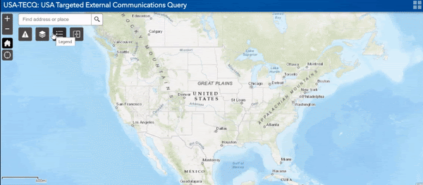

A while back, we shared a [blog post](https://www.performance.gov/2019-2-28-usda-blog-post/) about the U.S. Department of Agriculture’s (USDA) new communications tool. Known as the USA-Targeted External Communications Query (USA-TECQ), the tool provides quick, targeted communications to local communities. This allows local news outlets to be aware of federal news and activities. 

While the tool was created for disaster communications, there are several ways state and federal agencies can use it. We recently spoke with **Gabrielle Perret, Senior Media Advisor at the General Services Administration (GSA)**, about her experience with the tool. Check out what we learned!

<b style="font-size: 20px; color: 07648d">**Reaching a Local Audience**</b>

The USA-TECQ tool provides a user-friendly way to strengthen communication. Users can tailor and target audiences regionally or based on their proximity to a river or a railroad. With this tool, users can increase publicity and gain more media mentions.

  
Anytime you need to reach your audience on a local level, the tool is a great way to do so. It’s fast, accurate, and easy to use.” 
      
  - Gabrielle Perret
  

<b style="font-size: 20px; color: 07648d">**How it Works**</b>

The tool pairs maps and public datasets together to provide users with local media information. For example, a federal department or agency can quickly download a CSV file with local news outlets’ contact information. The agency can then rapidly communicate with those specific news outlets. This is particularly useful for disaster communications when agencies like the National Oceanic and Atmospheric Administration or the Federal Emergency Management Agency need to quickly communicate with regions impacted by a hurricane or flood. 

Before this tool, agencies relied on manual lists or other means to pull together media lists. These methods traditionally take much longer to create a contact list of local news contacts.  

For example, with the TECQ tool, one federal agency pulled localized data together in less than two hours for a project. With other tools, it could potentially take a team of four days to pull the necessary information. 

<i style="font-size: 15px;">GIF showing the USA-TECQ tool in action.</i>

  
GSA’s Media Affairs team routinely uses the tool to pull hyper-local media queries for GSA events around the country, most notably for openings of new federal buildings and U.S. Courthouses or when we dispose of surplus property.” 
      
  - Gabrielle Perret
  

<b style="font-size: 20px; color: 07648d">**Getting the Most out of the Tool**</b>

There is not one way to view and use the tool. Users can explore many data layers that can be added to the tool. In many cases, layers have already been created by your department, other departments, or are in the public domain. 

Some of the data layers contain: 
- Congressional district lines
- Municipal boundaries
- Rail/Amtrak stations and operating lines
- Federal highways and interstates
- Airports of all sizes
- Marine highways and ports
- Native American tribal boundaries and lands

<i style="font-size: 15px;">GIF showing USA-TECQ tool highlighting U.S. railways.</i>

  
A Regional Public Affairs Officer told me she used the tool to send her press release to local outlets that were previously unknown to her. After she did this, several picked up the story and ran the official photos she had sent! It was a wonderful way to reach GSA’s stakeholders who were interested in the news of a new courthouse.” 
      
  - Gabrielle Perret
  

Gabrielle also explained how the tool brought value when GSA held a public customer experience hackathon last year. The competition was held at eight locations around the country. The event was an important opportunity for GSA to improve customer experience on several major IT platforms. 

When attendance numbers needed a boost, Gabrielle quickly jumped on the tool to pull targeted queries of reporters whose audiences lived within driving distance of the cities in which GSA was holding the competitions. After using the tool to target local media outlets with the event information, GSA’s registration numbers jumped and attendance exceeded expectations.  

<b style="font-size: 20px; color: 07648d">**The Bottom Line**</b>

  
This is an incredible “good for government” product from USDA. It enables government agencies to reach citizens, small businesses, and other stakeholders at the local level where they get news in a cost-effective way.” 
      
  - Gabrielle Perret
  

Gabrielle and her team at GSA are one of many agencies that use the tool. Currently, the Department of Health and Human Services uses the tool to notify communities about COVID-related information. For many, the cost is minimal and the benefit enormous. Today, 24 federal agencies and 20 state governments use this tool to spread awareness on important topics.

*If you are a state or federal agency that would like to learn more about how to access the tool, please reach out to its creator, [Dirk Fillpot](mailto:Dirk.Fillpot@oc.usda.gov). You can also learn more information about the tool on [USDA’s website](https://www.fgdc.gov/organization/coordination-group/meeting-minutes/2018/september/usa-tecq-presentation-to-fgdc-cg-20180911.pdf).*

