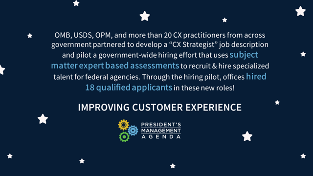
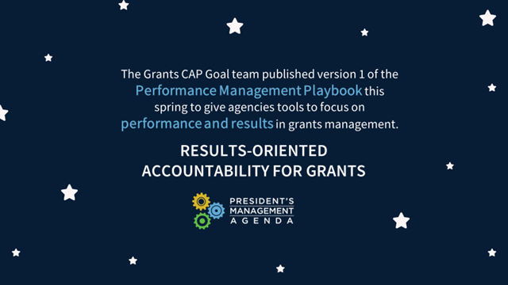
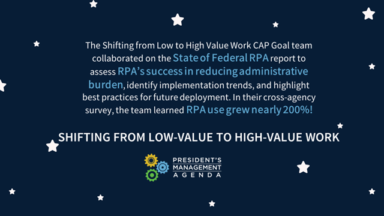
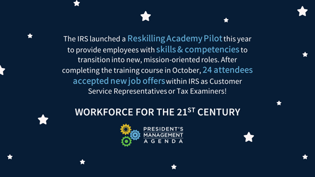

**January 7, 2021** - Today, we published progress updates for both Cross-Agency Priority (CAP) Goals and Agency Priority Goals (APGs) for Quarter 4 of FY2020. These updates highlight recent milestones and accomplishments as well as related initiatives that support progress towards a more modern and effective government.

In addition to this quarter’s CAP Goal and APG progress updates, we’ve included several highlights from the past year that showcase cross-agency efforts to advance mission, service, and stewardship on behalf of the American people.

### Cross-Agency Priority Goal Highlights

**Improving Customer Experience**

In partnership with the U.S. Digital Service and the Office of Personnel Management, the [Customer Experience (CX) CAP Goal](https://www.performance.gov/CAP/cx/) team piloted a [government-wide hiring effort](https://www.performance.gov/CX-hiring-pilot/) this year to help recruit and hire specialized CX talent. More than 800 applicants applied for 30 new “CX Strategist” positions across more than a dozen agencies. The team kicked off a pilot cohort of 18 highly-qualified CX professionals, many of whom are experts from outside of the Federal Government.

**Results-Oriented Accountability for Grants**

As part of the cross-agency initiative to maximize the value of grant funding, the [Grants CAP Goal team](https://www.performance.gov/CAP/grants/) published the [Performance Management Playbook](https://www.performance.gov/CAP/innovation-sessions/Managing%20for%20Results,%20Performance%20Management%20Playbook%20for%20Federal%20Awarding%20Agencies.pdf) to help agencies move toward a results-oriented grants management culture. The playbook also informed the August 2020 revisions to [Title 2 of the Code of Federal Regulations](https://www.federalregister.gov/documents/2020/08/13/2020-17468/guidance-for-grants-and-agreements), another key accomplishment which further sets the stage for enhanced results-oriented accountability for grants.

**Shifting from Low-Value to High-Value Work**

The General Services Administration and the Robotic Process Automation (RPA) Community of Practice released the [State of Federal RPA report](https://digital.gov/pdf/state-of-federal-rpa.pdf) in November 2020, which reported nearly 200% growth in RPA use among 23 agencies surveyed. This increase in adoption shows significant progress toward the Shifting from [Low-Value to High-Value Work CAP Goal](https://www.performance.gov/CAP/low-value-to-high-value-work/) and its efforts to reduce administrative burden across government.

**Developing a Workforce for the 21st Century**

The Internal Revenue Service (IRS) launched a Reskilling Academy Pilot as an initiative under the [Workforce CAP Goal](https://www.performance.gov/CAP/workforce/) to provide new career opportunities for employees. After the six-week training course, employees are fully certified and qualified to enter new full-time jobs in roles that directly support the IRS’ mission to expand and strengthen support for taxpayers.

Check out more highlights of key FY2020 CAP Goal progress featured on the Performance.gov [Twitter](https://twitter.com/PerformanceGov) and [LinkedIn](https://www.linkedin.com/company/35429296/admin/) pages.

### What’s Next
Today’s CAP Goal and APG updates are the final round of progress updates to be released until new goals are established. Stay tuned as we continue to highlight key progress toward a modern, more effective government on our [Twitter](https://twitter.com/PerformanceGov) and [LinkedIn](https://www.linkedin.com/company/35429296/admin/) pages.

***

### How to Find the Action Plans & Progress Reports

To view APG updates:
1. Click on “Agencies” on the menu at the top of the page
2. Click on the name of the agency that you'd like to view
3. Select the title of the APG from the menu on the left side of the page
4. Find the January 2021 Action Plan under “Goal Action Plans & Progress Updates” click "download"

To view CAP Goal updates:
1. Click on "Management Priorities" on the menu at the top of the page
2. Select the goal you'd like to view
3. Find the January 2021 Action Plan under "Action Plans and Updates" click "download"
